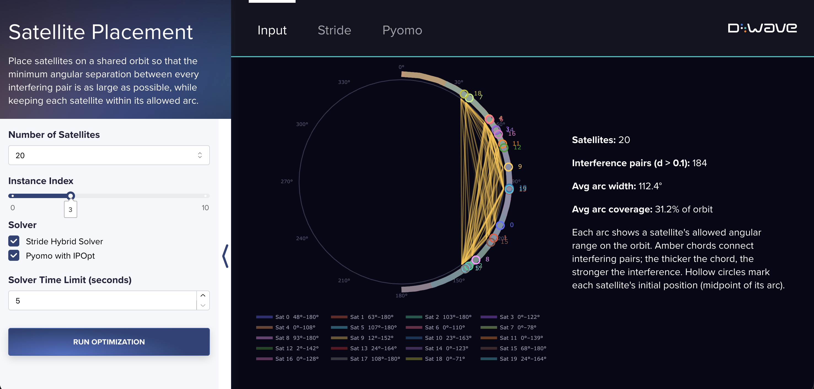

# Satellite Placement

A set of satellites is to be placed along a shared orbital arc. Each satellite has allowed east
and west boundaries, and between each pair of satellites there is an interference value
that decreases with distance. The goal is to place the satellites so that the maximum interference
experienced by any pair is minimized. This example compares D-Wave's Stride&trade; hybrid
solver to a classical Pyomo / Ipopt formulation, based on the problem and formulations described
in the [D-Wave Satellite Placement vignette](https://docs.dwavequantum.com/en/latest/industrial_optimization/vignette_satellite.html)
(see [[1]](#1)).



## Installation
You can run this example without installation in cloud-based IDEs that support the
[Development Containers Specification](https://containers.dev/supporting) (aka "devcontainers")
such as GitHub Codespaces.

For development environments that do not support `devcontainers`, install requirements:

```bash
pip install -r requirements.txt
```

IPOpt (required to run the classical comparison) must also be installed separately, using one of the
following commands:

| Platform | Command |
|---|---|
| macOS | `brew install ipopt` |
| Ubuntu / Debian | `sudo apt install coinor-ipopt coinor-libipopt-dev` |

## Usage
Your development environment should be configured to access the
[Leap&trade; quantum cloud service](https://docs.dwavequantum.com/en/latest/ocean/sapi_access_basic.html).
You can see information about supported IDEs and authorizing access to your Leap account
[here](https://docs.dwavequantum.com/en/latest/ocean/leap_authorization.html).

Run the following terminal command to start the Dash application:

```bash
python app.py
```

Access the user interface with your browser at http://127.0.0.1:8050/.

The demo program opens an interface where you can configure problems and submit these problems to
a solver.

Configuration options can be found in the [demo_configs.py](demo_configs.py) file.

> [!NOTE]\
> If you plan on editing any files while the application is running, please run the application
with the `--debug` command-line argument for live reloads and easier debugging:
`python app.py --debug`

## Problem Description

Satellites on a shared circular orbit can interfere with one another when
positioned too close together, and that interference decreases with angular
distance. Each satellite has an allowed arc, a range of angular positions it may
occupy, and each pair of satellites has a scalar interference value.

**Objective**: Maximize _z_, the minimum weighted angular separation across all
interfering pairs. A larger _z_ means every pair is spread further apart
relative to its interference strength, minimizing the maximum interference
experienced by any pair.

**Constraints**:
- Each satellite must remain within its designated arc [_Wᵢ_, _Eᵢ_].
- For every interfering pair, the angular gap must be at least proportional
  to the interference value, that is, pairs that interfere more must be kept further apart.

## Problem Instances

The three instance files in `input/` cover 5, 10, and 20 satellites, with 11
instances each. Instances are generated as follows:

- Global west and east boundaries are 0° and 180°.
- Each satellite's midpoint is drawn uniformly from [0°, 180°]; a radius of up
  to 70° (clamped at the global boundaries) determines its allowed arc.
- Interference values are drawn uniformly from [0, 1].

## Pyomo with Ipopt Formulation

Based on the formulation from Spalti et al. (1991) (see [[2]](#2)),
this uses [Pyomo](https://www.pyomo.org/) `ConcreteModel` and the open-source
interior-point solver [Ipopt](https://coin-or.github.io/Ipopt/). Rather than
encoding satellite order with binary variables, it uses absolute value in the constraints.

### Parameters

| Symbol | Description |
|---|---|
| _n_ | Number of satellites |
| _Wᵢ_ | West (lower) angular boundary for satellite _i_, in degrees |
| _Eᵢ_ | East (upper) angular boundary for satellite _i_, in degrees |
| _dᵢⱼ_ | Interference value for satellite pair _(i, j)_, _dᵢⱼ_ ∈ [0, 1] |

### Variables

| Symbol | Type | Description |
|---|---|---|
| _θᵢ_ | Continuous, _θᵢ_ ∈ [_Wᵢ_, _Eᵢ_] | Angular position of satellite _i_ on the orbit |
| _z_ | Continuous, _z_ ≥ 0 | Minimum weighted separation (the objective value being maximized) |

### Objective & Constraints

Maximize _z_ subject to:

```
dᵢⱼ · z  ≤  |θⱼ − θᵢ|  ≤  360 − dᵢⱼ · z     for all 1 ≤ i < j ≤ n
Wᵢ  ≤  θᵢ  ≤  Eᵢ                              for all 1 ≤ i ≤ n
```

### Implementation

- `model.z` — scalar separation variable, bounded in [0, 1000].
- `model.thetas` — position variables bounded to [_Wᵢ_, _Eᵢ_] via `theta_bounds`,
  warm-started at the midpoint of each satellite's arc.
- `constraint_rule1` enforces |θⱼ − θᵢ| ≥ dᵢⱼ · z;
  `constraint_rule2` enforces |θⱼ − θᵢ| + dᵢⱼ · z ≤ 360.
- Ipopt's `max_cpu_time` option is set to the user-configured time limit.

> [!NOTE]\
> Using `abs()` makes the problem nonlinear. Ipopt may return a locally optimal
> solution rather than a global one, particularly for larger instances.

## Stride Hybrid Solver Formulation 

This formulation replaces the binary order-encoding variables of a MIP with a
[`list()`](https://docs.dwavequantum.com/en/latest/ocean/api_ref_optimization/models.html#dwave.optimization.model.Model.list)
variable representing a permutation σ of the satellites. The model is built with
[`dwave.optimization`](https://docs.dwavequantum.com/en/latest/docs_optimization/index.html)
and submitted to D-Wave's
[Stride hybrid solver](https://docs.dwavequantum.com/en/latest/docs_hybrid/reference/samplers.html).

### Variables

| Symbol | Type | Description |
|---|---|---|
| σ | Permutation (`list`) | Ordering of satellite indices |
| _θᵢ_ | Continuous, _θᵢ_ ∈ [_W_σ(i)_, _E_σ(i)_] | Position of the satellite at index _i_ in σ |
| _z_ | Continuous, _z_ ≥ 0 | Minimum weighted separation |

### Objective & Constraints

For each candidate ordering σ, the model solves an embedded linear program over
_x_ = (θ₁, …, θₙ, _z_). Letting σ(i) denote the satellite at position _i_:

```
minimize  c · x
subject to  A · x  ≤  b
            l  ≤  x  ≤  u
```

where the constraints expand to:

```
 θⱼ − θᵢ + d_σ(i)σ(j) · z  ≤    0     for all i < j
−θⱼ + θᵢ + d_σ(i)σ(j) · z  ≤  360     for all i < j
```

`c = (0,…,0,−1)`, `b = (0,…,0, 360,…,360)`, and bounds `l`/`u` are the
west/east boundaries reordered by σ.

### Implementation

- `model.list(n)` is the permutation variable for n satellites.
- `linprog(c=c, A_ub=A, b_ub=b, lb=W, ub=E)` is the embedded LP.
- `model.add_constraint(lp.success)` checks if the LP is feasible.
- `lp.x[-1]` is _z_; `lp.x[:n]` are _θᵢ_ in permuted order, un-permuted before returning.

## Code Overview

```
app.py              — Dash app entry point
demo_configs.py     — Tunable UI defaults (satellite counts, time limits, etc.)
demo_interface.py   — Dash layout builder
demo_callbacks.py   — Dash callback logic (problem loading, solver dispatch)
src/
  stride.py         — Stride NL model and solve_instance()
  pyomo.py          — Pyomo/Ipopt model and solve_instance()
  plot.py           — Plotly orbital visualization
  utils.py          — Shared helpers (midpoints, color palette, instance I/O)
  demo_enums.py     — SolverType enum for solver dispatch
input/
  satellite_instances_180_5.json   — 11 instances, 5 satellites each
  satellite_instances_180_10.json  — 11 instances, 10 satellites each
  satellite_instances_180_20.json  — 11 instances, 20 satellites each
```

Instance JSON files each contain a list of problem dicts with keys
`num_satellites`, `boundaries` (west/east arrays), and `interferences`
(flattened n × n matrix).

## References

<a name="1">[1]</a> D-Wave Systems, "Satellite Placement". https://docs.dwavequantum.com/en/latest/industrial_optimization/vignette_satellite.html

<a name="2">[2]</a> Susan B. Spalti, et al. “Modeling the satellite placement problem as a network flow problem with one side constraint.” OR Spektrum, Vol. 13, no. 1 (March 1991): 1-14. https://doi.org/10.1007/BF01719766


## License

Released under the Apache License 2.0. See [LICENSE](LICENSE) file.
